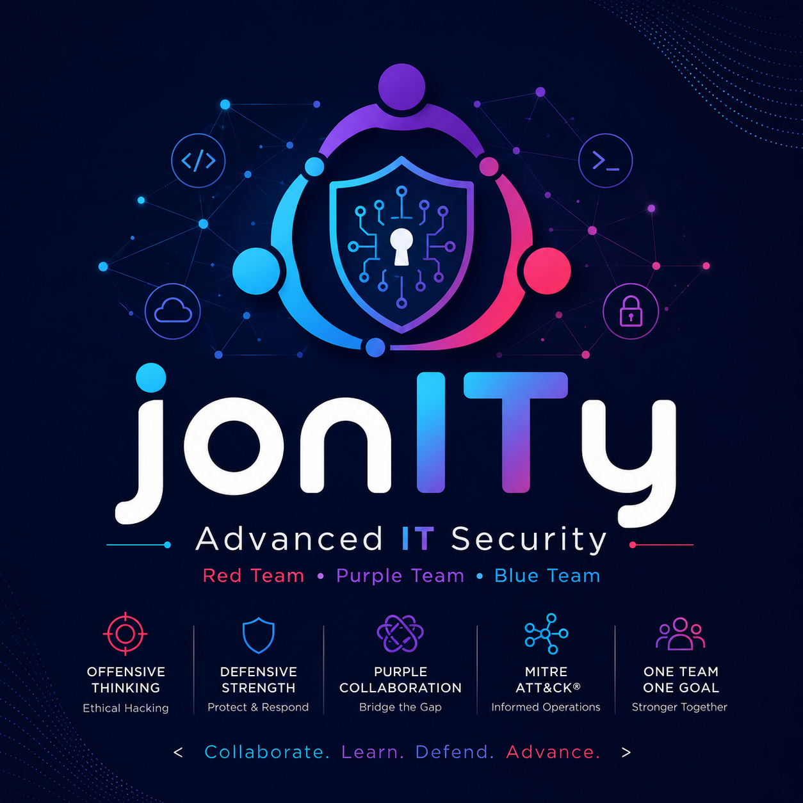

  

# jonITy

This repository is used for the initial setup of our team in the **Advanced IT Security** course at **Chas Academy**.

## Purpose

- Create a shared foundation for the team's work
- Establish a common structure and workflow
- Prepare for upcoming projects and repositories throughout the course

This is the first of several repositories that will be used throughout the course.
